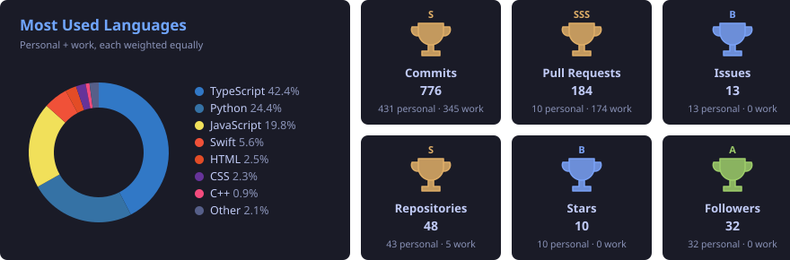
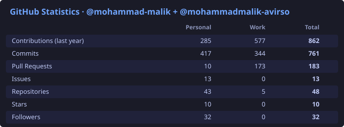

<h1 align="center">Hi 👋, I'm Mohammad Malik</h1>

  <b>Software Engineer II</b> · Backend & AI Consultant

  
  
  

I'm a 22 year old Software Engineer from Islamabad, Pakistan 🌆, with a deep passion for AI and coding in general.
My main line of work is building backend systems and AI agents for enterprise clients. I thrive on solving complex problems by blending creativity with logic, and my curiosity drives me to dive deep into new technologies, constantly learning and adapting to challenges.

- 🔭 Working on **enterprise applications**
- 🌱 Learning **scalable data design**
- 🧠 Into **agentic AI, AI research, automation, big data and optimization**
- 💬 Ask me about **LLMs, backend system design, DevOps, cloud and data analysis**
- 🤝 Open to **collaborations and interesting projects**

 

## 🔗 Languages and Tools

  

## 🏆 Languages & Trophies

  

## 📊 Statistics

  

## 📈 Contributions

  

---

  

---
